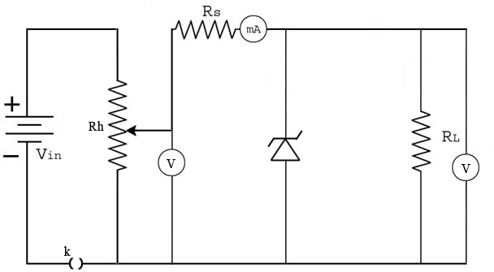
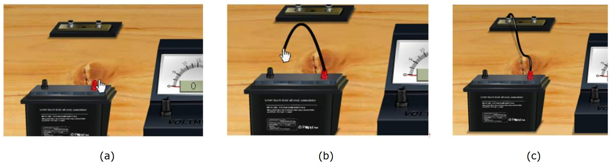

## Procedure

### Apparatus:
 
Diode, resistor, variable DC power supply, milliammeter, voltmeter, Rheostat and wire.

<h2>Controls</h2>

<ul>
  <li><strong>Insert Key Button:</strong> This is used to insert the key on the switch connected with the battery. This key is only activated when the connection is perfect.</li>
  <li><strong>Choose Zener Diode:</strong> This combo box is used to select different Zener diodes having different Zener voltages.</li>
  <li><strong>Series Resistance:</strong> The value of the series resistance can be directly input here.</li>
</ul>

<h3>Slider</h3>
<ul>
  <li><strong>Rheostat Value:</strong> The rheostat can be controlled by using this slider.</li>
  <li><strong>Load Resistance:</strong> The value of the load resistance can be set or changed using this slider.</li>
</ul>

<h3>Button</h3>
<ul>
  <li><strong>Reset Button:</strong> Used to reset all the connections.</li>
</ul>

<h2>Procedure</h2>

Using the circuit diagram, identify the connections in the given platform. Connections are made as shown in the diagram below.

 

### How to make connections in simulation ?
 

Click one end node of the battery and drag to the next position, where we want to connect the wire. Just like shown in the figures below:

 

### Connection diagram 

 

- If the connections are correct, the **Insert Key** option is activated.

- Slowly increase the reverse voltage in small increments.

- Record the voltage across the Zener diode and the corresponding current.

- Continue increasing the reverse voltage until the Zener breakdown voltage is reached. Beyond this point, observe that the voltage across the diode remains nearly constant while the current increases rapidly.

**Note**: This is an ideal circuit. For a real circuit, there will be small variations in output voltage with varying input voltage or load resistance.
